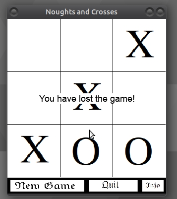
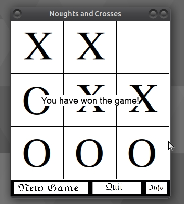

#  Noughts and Crosses

[Noughts and Crosses](https://en.wikipedia.org/wiki/Tic-tac-toe), also known as a TicTacToe or Xs and Os, is a popular board game for 2 players. 

## Installation

Standalone executables are available and tested for Windows 10 and Linux(Ubuntu 18.04) systems. Please download the game using [Windows](https://github.com/piotrpatrzylas/NoughtsAndCrosses/blob/master/Windows%20Installer/Installer.exe) or [Linux](https://github.com/piotrpatrzylas/NoughtsAndCrosses/blob/master/Linux%20dist/Noughts%20and%20Crosses) version.

## Status

In development. Please see [issues](https://github.com/piotrpatrzylas/NoughtsAndCrosses/issues).

## Features

* currently only one mode: Player vs Computer
* randomly assign player to X or O
* first turn is X
* one difficulty level - easy (AI randomly places X or O)

## Examples

Below the screenshots of the game aesthetics:  

  
  
  
  
## Licence
[WTFPL](https://en.wikipedia.org/wiki/WTFPL)

## Author
Piotr Patrzylas, London 2020
